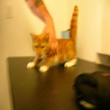

# Bootcamp_2 Pytorch : Cat vs. Dog Classifier 

In this simple project we have a small dataset of cats and dogs, our classifier's task is to predict one of those two classes.

 Cat         | Dog
:------------|-------------
|

